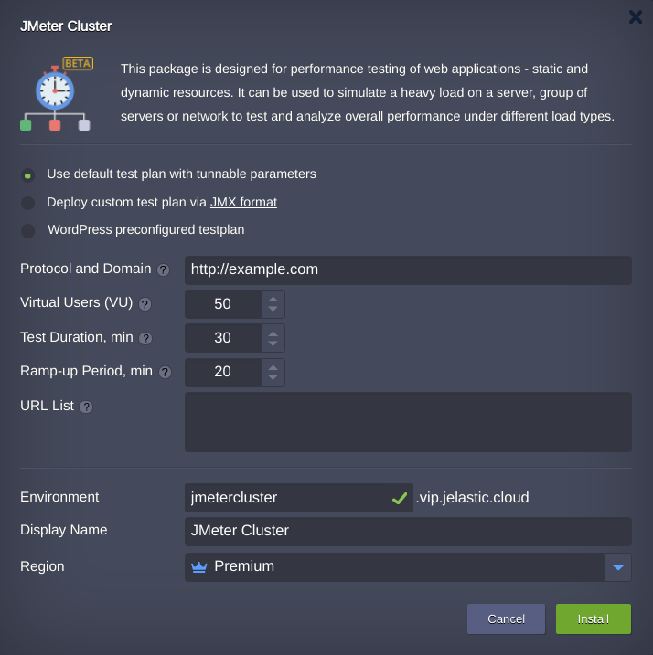
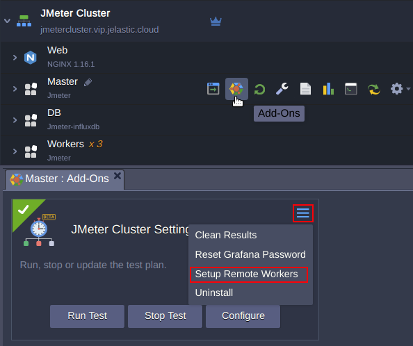
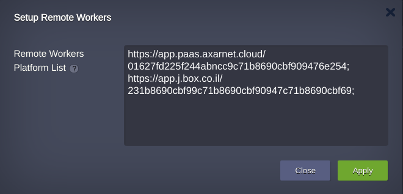
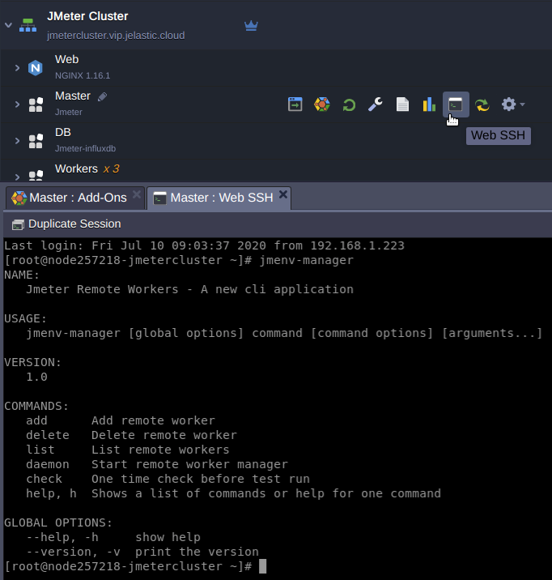
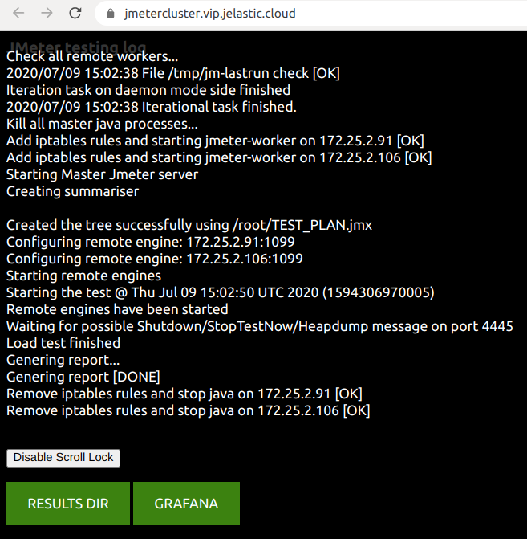

# JMeter Cluster

**JMeter** is a software that can perform a stress test, a performance-oriented business (functional) test, a regression test, etc. with various protocols and technologies targeting remote systems. 

Jelastic package **JMeter-cluster** implements automated solution  that allows to carry out rapid web-site performance benchmark testing in a minutes with no specific knowledge required. The package installs application optimized for three different testing appliance that can be changed at any time with reconfiguration functionality.  

## Installation

Get your Jelastic account at any of available [hosting provider](https://jelastic.cloud/).

Click the **DEPLOY TO JELASTIC** button, specify your email address within the widget and press **Install**.

> **Note:** If you are already registered at Jelastic, you can deploy this cluster by importing the  [package manifest raw link](https://raw.githubusercontent.com/jelastic-jps/jmeter-cluster/master/manifest.jps).  

Once the manifest is imported, make a choice which appliance fits best your benchmarking.

1. **Use default test plan with tunnable parameters**  

  The key test plan parameters that available in the installation window are:  
  
  - **Protocol and Domain**. The list of supported protocols is provided in [JMeter](https://jmeter.apache.org/index.html) documentation.
    
  - **Virtual Users (VU)**. This is a number of concurrent threads the JMeter will use for testing.
    
  - **Test Duration**, min. This option is limited to 60 minutes.
    
  - **Ramp-up Period, min**. This is the time during which virtual users will be available to send requests to the target. It allows you to make a smooth and predictable start.
  
  - **URL List**. Specify here the site URLs you need to take part in the testing. E.g. */index.php* */hello-world.php* separated by space.
  
2. **Deploy custom test plan via** **[JMX format](https://cwiki.apache.org/confluence/display/JMETER/JmxTestPlan#JmxTestPlan-JMXFormat)**. This option allows to conduct a [self created](https://jmeter.apache.org/usermanual/build-test-plan.html) custom test plan. 

  

  
3. **Wordpress preconfigured testplan**. This option allows to run the tests optimized for the web sites based on WordPress CMS.

  

The JMeter settings are similar to the first clause and the target web site should be prepared according to this guide: [http://wordpresshostingbenchmarks.reviewsignal.com/setup-instructions/](http://wordpresshostingbenchmarks.reviewsignal.com/setup-instructions/). It requires to create users that will simulate your web site subscribers. This is can be done via WordPress CLI with a script:

  ***for SW_USER_I in {10..10010}; do wp --allow-root user create "username${SW_USER_I}" "username${SW_USER_I}@example.com" --user_pass="password123" --role="subscriber"; done;***

Log in via [SSH](https://docs.jelastic.com/ssh-access/) to your WordPress environment and run the script in command line from the WordPress installation directory.
User generation takes time, thus wait till the generation process is completed.

## Remote Workers Setup

In order to increase cluster capacity the remote workers can be added to the cluster. This is implemented through creating remote JMeter dashboards at [Jelastic hosting platforms](https://docs.jelastic.com/jelastic-hoster-info/). 

  

Fill in the list of workers with hosting platform's URL and [access token](https://docs.jelastic.com/personal-access-tokens/).

  

Alternatively you may manage remote workers with CLI: **jmenv-manager**

  

## Web Site Testing

To begin the test, open *JMeter Cluster* **Add-Ons** at **Master** node and press **Run Test**.

  

 Then popup window appears with an URL the test results can be reached.
 

  

  

 
You may go to [GRAFANA](https://grafana.com/) to monitor results in real-time or wait untill test will be comleted and observe the results summarized by JMeter clicking on the **RESULTS DIR** button.

